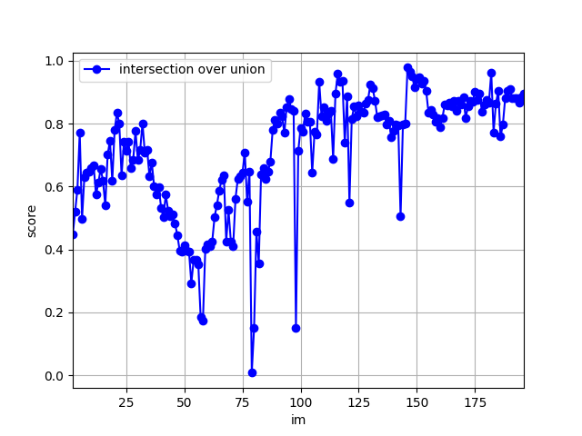
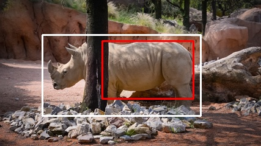
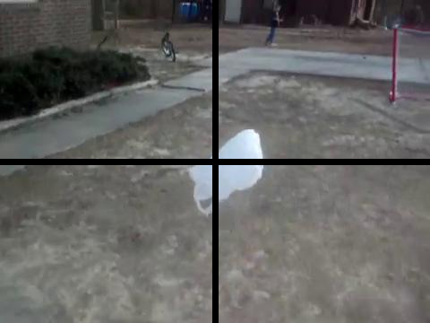
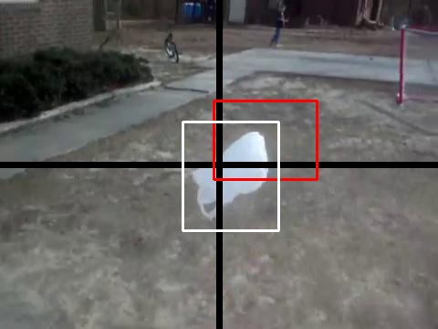
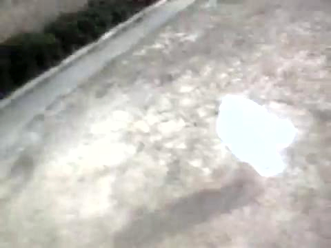
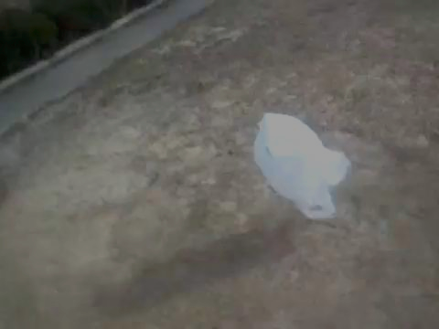
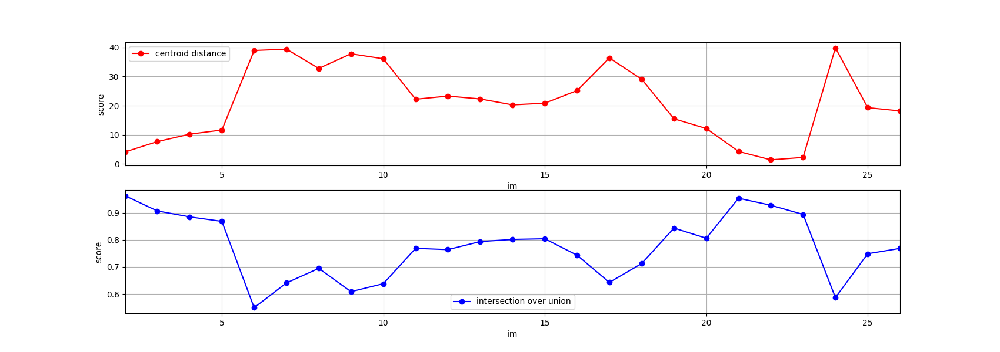
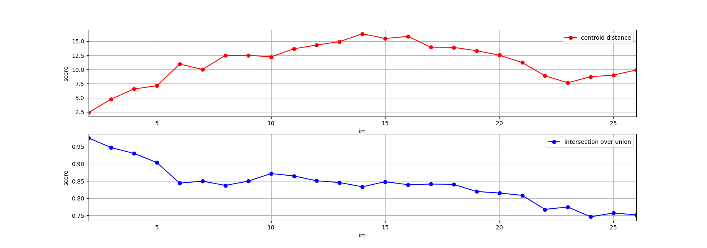

#  GOTURN method
### Edgard Dabier, Fabien Senequier & Nolan Sisouphathong

In this project we explore the GOTURN method for object tracking.

**Method overview :**
The goal of the basic GOTURN algorithm is to track an object on a video sequence. To do this, we provide the location of the object to track on the first image, and then it will propagate through images one by one, taking the current image's prediction as the location of the next image's search region to find the displaced object.

### Project pick up

We started by downloading the pre-trained GOTURN model from the [pygoturn](https://github.com/amoudgl/pygoturn) repository. This code is necessary to be able to use the GOTURN model in our `project_test.ipynb` file, that computes the accuracy of the prediction (in terms of the predicted bounding boxes' centroids to the ground truth centroids)

We had to format the provided test data to fit the expected input of the GOTURN algorithm (`OTB format` = a folder for each sequence with a subfolder containing the actual images composing the video, as well as a `groundtruth_rect.txt` file containing the top left coordinate of the boudning box, as well as the width and height of the box). 

This was done using the `add-bounding-box.ipynb` notebook

Then we could test the pre-trained model out of the box as it is done in the `project-test.ipynb` file, in the section **GOTURN method**

Doing so, we could compare the predicted bounding boxes' centroid with the ground truth for the different sequences. We obtain graphs like this: 

  

### First observations

### Further exploration
#### - *Occlusion tests*

In the paper, it is explained that a limitation of this method is its difficulty to handle occlusions. This is due to how the algorithm is designed as it only relies on the previous image to find the object on the next one, and if the object gets occluded, it will only detect a part of it. We have observed it on the rhino sequence:

  

As we can see, only the back of the rhino is recognized, which is expected as it is the part of the rhino that could be seen on the previous image.

To further explore this occlusion problem, we created altered versions of the images by adding crossing lines on top of them to see how the model would handle such occlusion:

  

As expected, the model struggles to keep track of the object when it goes behind the lines:

  

#### - *Contrast change test* 

The paper also mentions difficulties with changes in contrast and brightness. To visualize this problem, we generated altered versions of the images by randomly changing their contrast, giving results like:

  
  

Overall, this seems to make a little difference. Applying a random contrast change to the images (between 0.2 and 1.8), we obtain the following results on the bear sequence (average `IoU` score: 0.77):

  

Compared to running the model with no change in the brightness (average `IoU` score: 0.84):

  

#### - Large movement tests

The GOTURN paper is based on the assumption that the object movements are small enough to lie within a restricted area on the next frame. To see how this assumption could lead to tracking issues, we tried feeding the network not two consecutive images but ones separeted by varying number of images (up to a 10 images gap). Doing this, we make the tracking object move artificialy fast because we skip many positions.

#### - *Conclusion*

As a conclusion, these experiments have allowed us to visualize the impact of occlusion and changes in lighting conditions on the prediction, as well as the limitations of the assumption of small movements. As expected and described by the paper, these factors do reduce the quality of the prediction.
